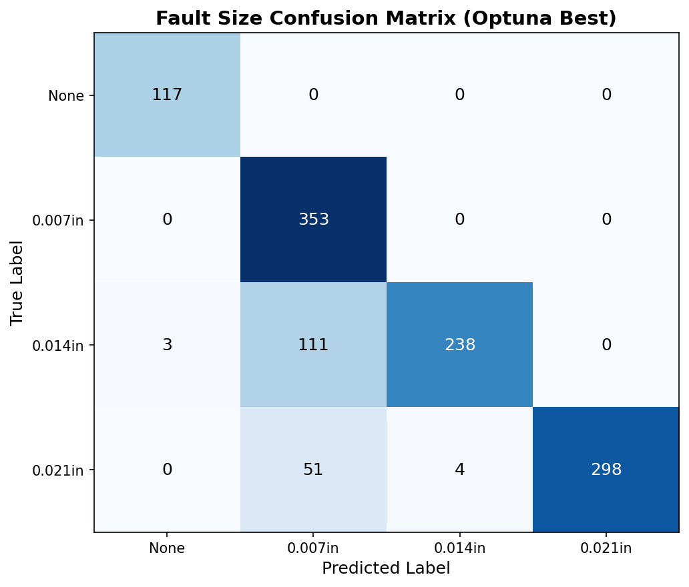
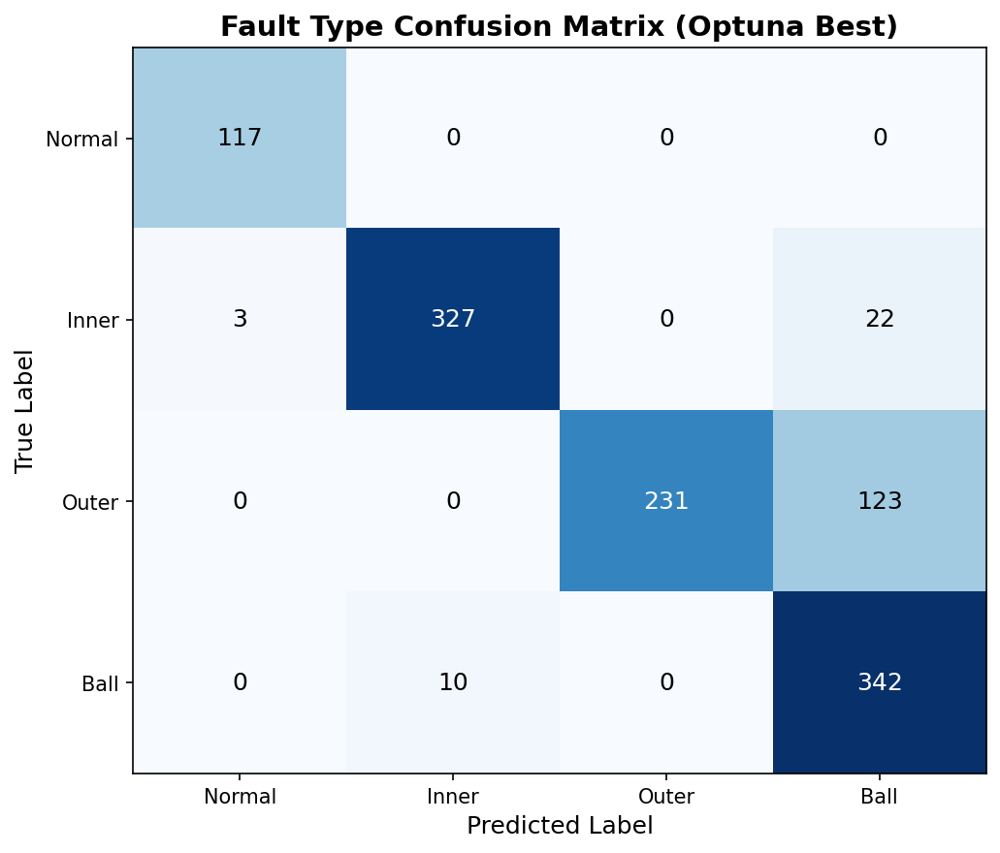
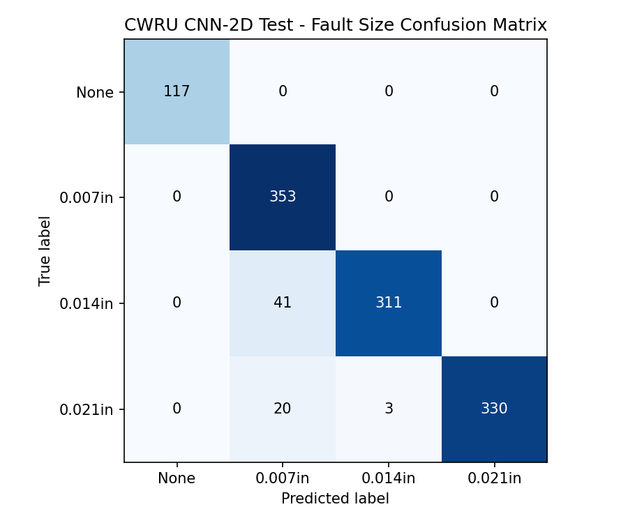
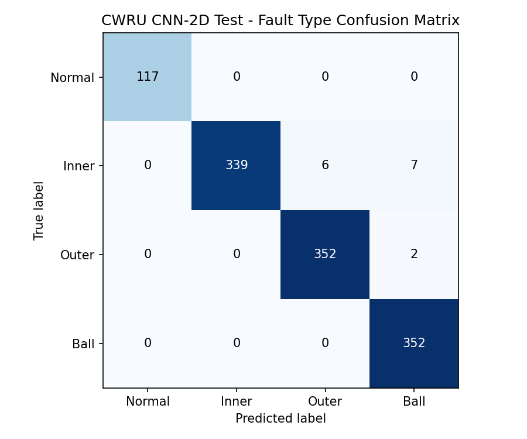

# CWRU 轴承故障诊断：CNN-1D 与 CNN-2D 对比研究

## 项目背景

旋转机械的轴承故障是工业设备失效的主要原因之一。传统的轴承故障诊断依赖人工特征提取（如时域统计量、频域包络谱分析），需要领域专家介入且泛化能力有限。本项目基于 **凯斯西储大学（CWRU）轴承数据中心**的公开数据集，探索深度学习在端到端故障诊断中的应用，核心关注 **输入表征对模型性能的影响**——即：** 时域波形（CNN-1D）**与 **STFT 时频图（CNN-2D）** 两种表征方式的诊断效果对比。

CWRU 数据集包含 4 种负载工况（0HP~3HP）下的振动加速度信号，涵盖正常状态及三种故障类型（内圈、外圈、滚动体）× 三种故障尺寸（0.007、0.014、0.021 英寸），共 3*3+1 分类任务。实验采用 **按负载划分数据集**（0HP+1HP 训练 / 2HP 验证 / 3HP 测试）的严格方案，以确保模型在未见过负载下的泛化能力得到真实评估。

## 主要工作

### 1. 数据预处理与增强策略

- **滑窗切片**：窗口长度 8192 点（约 170ms），50% 重叠，兼顾时间分辨率与样本量
- **按负载划分**：训练集 = 0HP + 1HP，验证集 = 2HP，测试集 = 3HP，消除相邻滑窗跨越训练/测试集的数据泄漏风险
- **多级噪声增强**：训练时随机注入高斯白噪声，提升模型对噪声的鲁棒性
- **逐样本 Z-score 归一化**：消除不同工况下信号幅值差异的影响

### 2. CNN-1D 路线（时域波形输入）

- 搭建 **动态 CNN-1D 编码器**：可变层数（3~6 层）、可变通道数、可变卷积核大小，第一层使用宽卷积核+ 大步长快速压缩时间维度
- 设计 **多任务双分类头**架构：共享编码器提取特征，两个独立 MLP 分别预测故障类型
- 使用 **Optuna 多目标优化**（TPE 采样器）自动搜索超参数，在类型准确率和尺寸准确率的 Pareto 前沿上按 joint accuracy 选优
- 测试集结果：**联合准确率 86.09%**（类型 86.55%，尺寸 85.62%），参数量 13,645

### 3. CNN-2D 路线（STFT 时频图输入）

- 引入 **STFT 对数幅度谱图**作为输入
- 将编码器从 Conv1d 升级为 **Conv2d**，利用二维卷积同时捕获频率成分和时间演化模式
- 设计 **在线 STFT 转换**：每个 batch 实时将波形转换为谱图，避免预计算存储开销
- 逐层模拟空间尺寸，仅当池化后两个维度均 ≥2 时才添加 MaxPool2d，避免维度塌缩导致的 RuntimeError
- 验证集结果：**联合准确率 96.64%**（类型 98.72%，尺寸 96.64%），参数量 246,381

### 4. 对比分析

| 指标 | CNN-1D () | CNN-2D () |
|------|:---:|:---:|
| 输入表征 | 时域波形 | STFT 时频图 |
| 测试类型准确率 | 86.55% | 98.72% |
| 测试尺寸准确率 | 85.62% | 94.55% |
| 测试联合准确率 | 86.09% | 96.64% |
| 参数量 | 13,645 | 246,381 |

cnn-1d混淆矩阵

 

cnn-2d混淆矩阵

 

**结论**：CNN-2D 在时频域上优于 CNN-1D 在时域上的表现，验证了 **时频表征对轴承故障诊断的有效性**——二维卷积可以学习跨频率-时间的局部模式（如特定频带的冲击脉冲），这对应轴承故障的物理机理（不同故障类型在不同频带产生特征性调制），因此 CNN-2D 的表示能力远超仅依赖时域波形的 CNN-1D。

## 项目结构

```
project3/
├── code2/                   # 共享数据层
│   ├── config.py            # 数据路径、划分策略、标签映射
│   ├── dataset.py           # CWRUDataset 类（噪声增强、归一化）
│   └── preprocess.py        # 滑窗切片预处理脚本
├── code3/                   # CNN-1D 路线
│   ├── search_config.py     # 超参搜索空间定义
│   ├── search_model.py      # DynamicCWRUModel (Conv1d)
│   ├── search_train.py      # Optuna 多目标训练目标函数
│   ├── run_search.py        # 搜索入口
│   └── retrain_best.py      # 最优参数重训练 + 测试评估
├── code4/                   # CNN-2D 路线
│   ├── search_config_2d.py  # 超参搜索空间 + STFT 参数
│   ├── search_model_2d.py   # DynamicCWRUModel2D (Conv2d + 智能池化)
│   ├── stft_transform_2d.py # STFT 语谱图变换模块
│   ├── search_train_2d.py   # Optuna 目标函数（在线 STFT）
│   ├── run_search_2d.py     # 搜索入口
│   └── retrain_best_2d.py   # 最优参数重训练 + 测试评估
├── data/                    # CWRU 数据集（.mat 文件）
└── requirements.txt         # Python 依赖
```

## 运行环境

- **操作系统**：Windows 11 + WSL2 (Ubuntu)
- **Python**：3.10
- **CUDA**：12.2

```bash
# 安装依赖
pip install -r requirements.txt
```

## 运行方式

```bash
# 1. 数据预处理
cd code2
python preprocess.py

# 2. CNN-1D 路线
cd ../code3
python run_search.py       # 超参搜索
python retrain_best.py     # 重训练 + 测试

# 3. CNN-2D 路线
cd ../code4
python run_search_2d.py    # 超参搜索
python retrain_best_2d.py  # 重训练 + 测试
```

> 前置条件：`data/raw/` 目录下存放 CWRU .mat 文件及 `index_table.json`。
